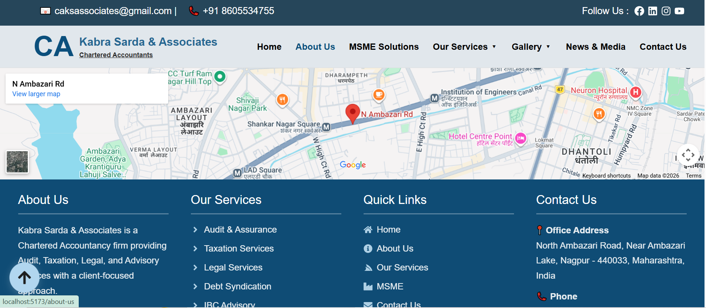

# Charterd-Accountant-CA-Portal

A modern and responsive Chartered Accountant (CA) Portal built with React, Node.js, Express.js, and MongoDB. Features include service management, gallery, news, contact forms, and a secure admin panel for content management

A full-stack Chartered Accountant (CA) Portal designed to provide professional accounting and financial services through an interactive and responsive web application. The platform allows clients to explore services, submit inquiries, and stay updated with the latest news, while administrators can efficiently manage website content through a secure dashboard.

---

## 🚀 Features

### 👨‍💼 Client Side

- Responsive and modern UI
- Home Page
- About Us
- Our Services
- MSME Solutions
- Gallery
- News & Media
- Contact Us Form
- Mobile Friendly Design

### 🔐 Admin Panel

- Secure Admin Login
- Dashboard
- Manage Services
- Add, Edit & Delete Services
- Manage Gallery
- Add, Edit & Delete Gallery Images
- Manage News & Media
- Add, Edit & Delete News Articles
- Manage Contact Messages

---

## 🛠 Tech Stack

### Frontend

- React.js
- React Router
- Bootstrap 5
- HTML5
- CSS3
- JavaScript (ES6)
- Axios

### Backend

- Node.js
- Express.js
- MongoDB
- Mongoose
- JWT Authentication
- bcrypt.js
- Multer
- dotenv
- CORS

---

## 📂 Project Structure

```
CA-Portal/
│
├── frontend/
│   ├── src/
│   │   ├── assets/
│   │   ├── components/
│   │   ├── pages/
│   │   ├── layouts/
│   │   ├── services/
│   │   ├── utils/
│   │   ├── App.jsx
│   │   └── main.jsx
│   └── package.json
│
├── admin/
│   ├── src/
│   │   ├── assets/
│   │   ├── components/
│   │   ├── pages/
│   │   ├── layouts/
│   │   ├── services/
│   │   ├── utils/
│   │   ├── App.jsx
│   │   └── main.jsx
│   └── package.json
│
├── backend/
│   ├── controllers/
│   ├── models/
│   ├── routes/
│   ├── middleware/
│   ├── config/
│   ├── uploads/
│   ├── utils/
│   ├── server.js
│   ├── package.json
│   └── .env
│
├── README.md
└── .gitignore
```

---

## 📸 Website Pages

- Home
- About Us
- Services
- MSME Solutions
- Gallery
- News & Media
- Contact

---

## 🔐 Admin Panel

The admin dashboard provides complete control over the website content with secure authentication.

### Dashboard Features

- Secure Admin Login (JWT Authentication)
- Interactive Admin Dashboard
- Manage Services
- Manage Gallery
- Manage News & Media
- Manage Contact Messages

### Advanced Content Management

- ➕ Add new content
- ✏️ Edit existing content
- 🗑️ Temporary Delete (Move to Trash)
- ♻️ Restore deleted content from Trash
- ❌ Permanently Delete content
- 🔄 Real-time updates that instantly reflect on the frontend without requiring code changes

The Trash Management system ensures that accidentally deleted content can be restored before being permanently removed, providing a safe and efficient content management workflow.

---

## ⚙️ Installation

### Install Frontend Dependencies

```bash
cd frontend
npm install
```

Run Frontend

```bash
npm run dev
```

---

### Install Backend Dependencies

```bash
cd backend
npm install
```

Run Backend

```bash
npm start
```

---

## 🔐 Environment Variables

Create a `.env` file inside the backend folder.

```env
PORT=5000

MONGO_URI=Your_MongoDB_URI

JWT_SECRET=Your_JWT_Secret

EMAIL_USER=Your_Email

EMAIL_PASS=Your_Email_Password
```

---

## 📦 Main Dependencies

Frontend

- React
- Bootstrap
- React Router DOM
- Axios

Backend

- Express
- Mongoose
- JWT
- bcryptjs
- Multer
- dotenv
- cors
- Nodemon

---

## 📱 Responsive Design

The website is fully responsive and optimized for:

- Desktop
- Laptop
- Tablet
- Mobile

---

## 📈 Future Enhancements

- Client Login Portal
- Online Appointment Booking
- Document Upload & Verification
- Email Notifications
- Payment Gateway Integration
- Dashboard Analytics
- Report Generation

---

## 👩‍💻 Developed By

**Kanchan Dhote**

GitHub: https://github.com/KanchanDhote015

---

## 📄 License

This project is developed for educational and portfolio purposes.

---

## 📸 Project Screenshots

### Client Portal

| Home Page | Contact Us |
|------------|------------|
|  |  |

| Footer |
|---------|
|  |

---

### Admin Panel

| Login | Dashboard |
|--------|-----------|
|  |  |

| Services | News |
|----------|------|
|  |  |

> **Admin Features:** Secure authentication, dashboard analytics, service management, news management, gallery management, contact management, temporary delete (Trash), restore, permanent delete, and automatic frontend synchronization.
